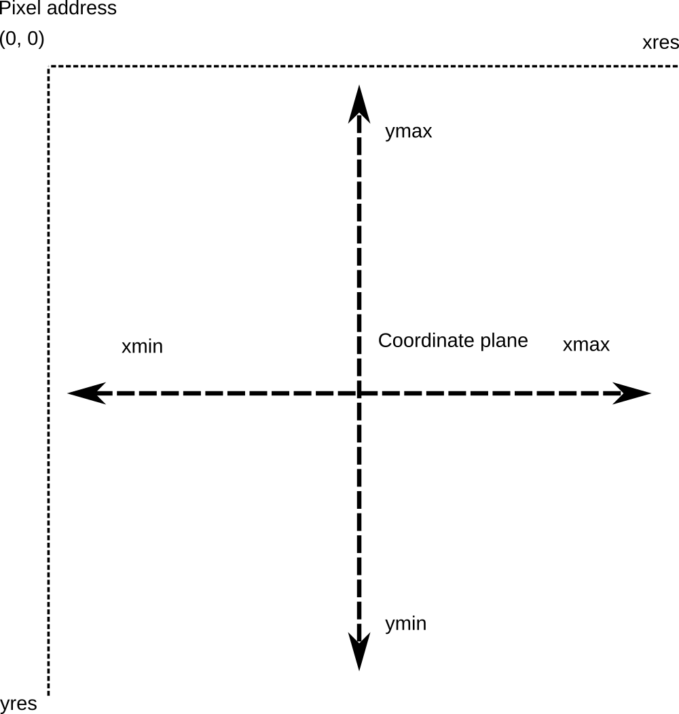

# PyFunctionGradient
Python script to draw function gradients

 * math.sin(x) * x")

# Background

This program allows you to define an equation in terms of X and Y, and solve it for all points in a region of the Cartesian plane.  The value of the function at the point will map to a color in the resulting image.

Configurable values of the function can be visualized in the image below.

# TODO

Add command line parsing 

